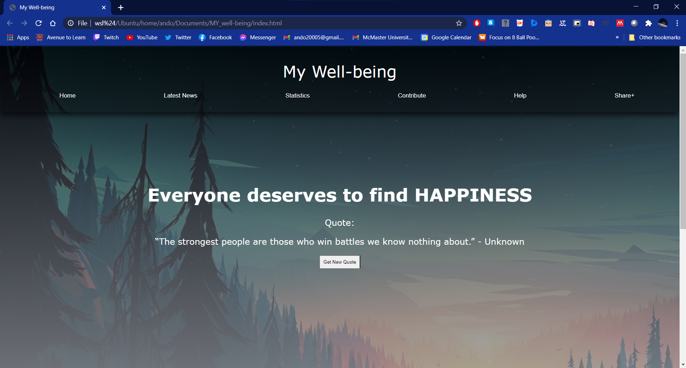
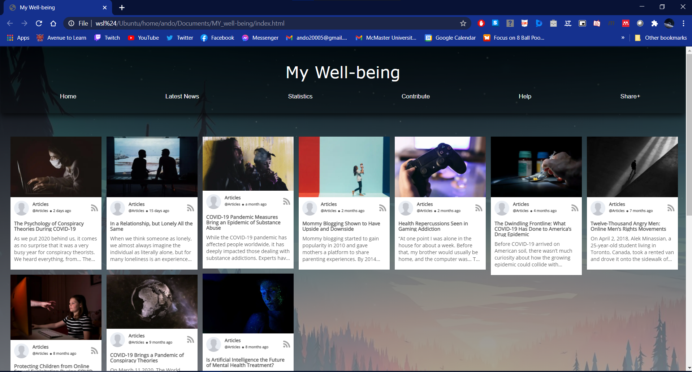
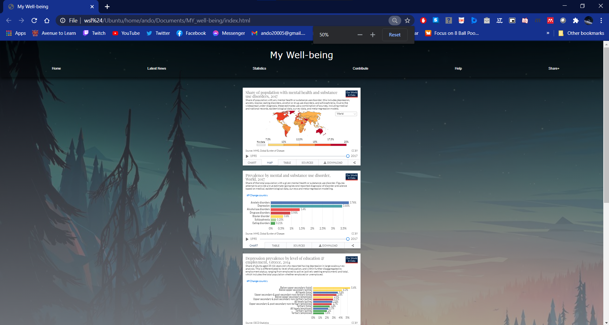
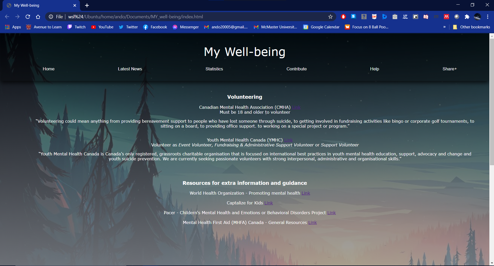
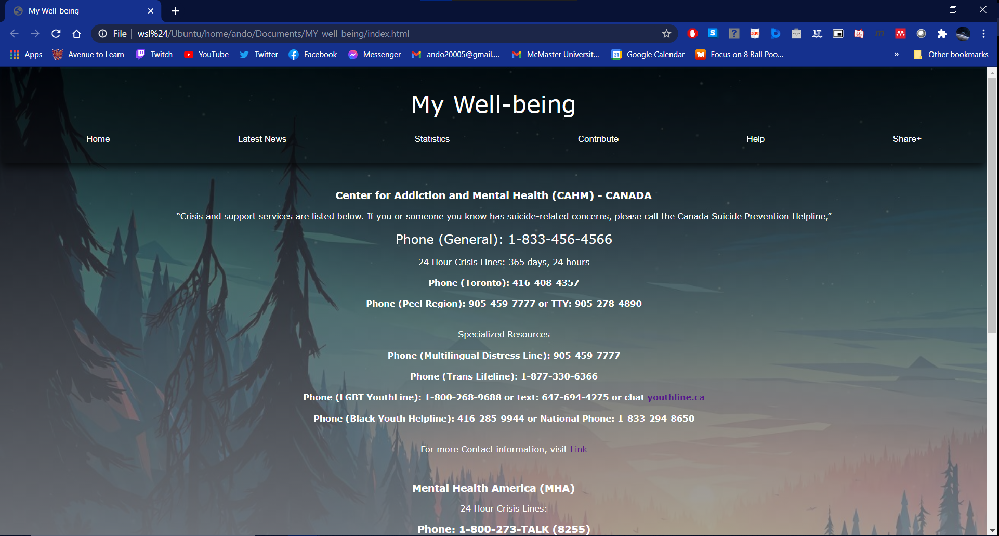
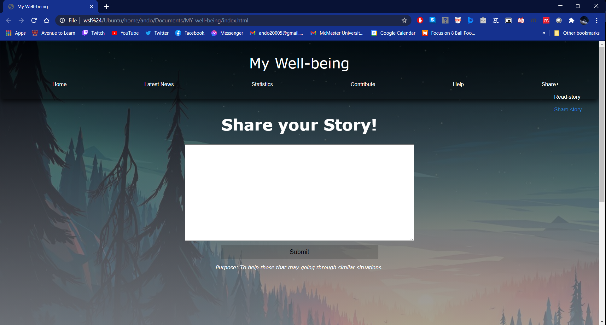

# MY_well-being

## Overview
My Well-Being is a website meant to provide awareness and support for individuals that are struggling with their mental health. It provides users with the latest news/articles regarding mental health (including ways to improve mental health), latest statistics, ways to contribute to mental health (i.e volunteering), multiple crisis helplines, and a discussion board for individuals to share their stories anonymously

## Screenshots

### Home

### Latest News

### Statistics

### Contribute

### Help

### Share
